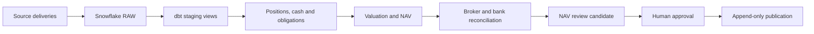

# Northbridge fund close platform

Northbridge is a production-style daily close for a fictional equity hedge fund.
It brings trades, settlement, market data and independent statements into
Snowflake; dbt calculates positions, cash and NAV; reconciliation controls expose
breaks before a separate reviewer can approve publication.

The project is designed as a realistic portfolio implementation. Real reference
data is combined with clearly labelled simulated operating data because broker,
bank and fund-administrator feeds are private and unavailable for a public demo.

## Current result

The development replay processes:

- 3,200 simulated executions across 20 US equities and two accounts;
- 23 valuation dates, including a day without trades;
- 3,168 settlement confirmations, including missing and late cases;
- 250,036 real daily price rows across 503 tickers;
- reviewed real corporate actions, ECB FX and US Treasury rates;
- simulated broker positions, bank balances, investor flows and expenses.

The dbt project has 20 models, 54 data tests and two reference seeds. An
independent Python calculation agrees with 920 valued positions and 46
account-day NAV balances. The Python suite has 235 tests.

## How the close works



Every close selects explicit delivery IDs. Missing or incomplete deliveries stop
the run. Exact retries keep the same run identity and append a new attempt. A NAV
approval is tied to a hash of the exact candidate, so changed results need a new
review.

## Data sources

| Source | Type | Purpose |
| --- | --- | --- |
| Massive prices | Real | Daily equity valuation |
| Massive corporate actions | Real | Dividend and split evidence |
| ECB FX rates | Real | EUR and GBP reporting views |
| US Treasury rates | Real | Cash-yield benchmark |
| OMS and settlement events | Simulated | Trades, positions, cash and obligations |
| Broker positions | Simulated independent feed | Position reconciliation |
| Fund administrator events | Simulated independent feed | Investor flows and expenses |
| Bank statements | Simulated independent feed | Cash reconciliation |

Simulated sources carry scenario identifiers and simulation flags. They are never
presented as observations from a real fund.

## Repository map

| Path | Purpose |
| --- | --- |
| `dbt/` | Active Snowflake transformations, reference seeds and data tests |
| `snowflake/` | Bootstrap, ingestion, operations, governance and task SQL |
| `terraform/snowflake/` | CI and production Snowflake foundations |
| `simulation/` | Fictional OMS event producer |
| `data_extraction/` | Real-data downloads, identity checks, repairs and assembly |
| `scripts/` | dbt, Snowflake, replay, publication and Terraform entry points |
| `fund_pipeline/` | Independent Python accounting control and local prototype |
| `fixtures/` | Small committed inputs used by tests and CI |
| `tests/` | Python regression tests |
| `docs/` | Current design, operation and source notes |
| `archive/` | Earlier lessons excluded from the active dbt graph |

Generated datasets, secrets, private keys, dbt output and Terraform state are
excluded from Git.

## Run the checks

```powershell
python -m unittest discover -s tests
python scripts/check_yaml.py
.\.venv\dbt\Scripts\python.exe scripts/dbt_dev.py parse
terraform -chdir=terraform/snowflake fmt -check -recursive
terraform -chdir=terraform/snowflake validate
```

Run the saved accounting replay with:

```powershell
python scripts/run_replay.py
```

Run the active Snowflake models and routine tests with:

```powershell
.\.venv\dbt\Scripts\python.exe scripts/dbt_dev.py build --exclude tag:fixture
```

The fixture-tagged acceptance tests assert the exact saved demonstration. They
are useful for a full replay but do not belong in an arbitrary daily delivery.

## Environments and deployment

| Environment | Current state |
| --- | --- |
| Development | Full replay, native dbt project and suspended task graph tested |
| Pull-request CI | Local checks plus optional isolated Snowflake clone build |
| Production | Database, schemas, roles, OIDC users, warehouse and monitor provisioned by Terraform |

Production transformations and scheduling are deliberately disabled. The next
release is a controlled production dry run: deploy RAW migrations, dbt and the
suspended task graph; land one complete test delivery; exercise failure and
retry; then approve one test NAV through the separate publisher path.

## Documentation

- [Current status and production gaps](docs/PROJECT_AUDIT.md)
- [Next milestones](docs/ROADMAP.md)
- [Daily operating flow](docs/daily_operations.md)
- [Active dbt model inventory](dbt/MODEL_INVENTORY.md)
- [CI/CD design](docs/CICD.md)
- [Snowflake governance](docs/snowflake_governance.md)
- [Snowflake performance decisions](docs/snowflake_performance.md)
- [Source integration summary](docs/final_sources.md)
- [Snowflake SQL index](snowflake/README.md)
- [Archived Python lessons](archive/python_lessons/README.md)
- [Archived dbt lessons](archive/dbt_lessons/README.md)

## Scope

The accounting scope is USD listed equities. The platform does not yet account
for stock borrow, margin, withholding tax, options, futures or bonds. The anomaly
model is also deferred until reviewed daily exceptions provide useful labels.
These are documented extensions rather than claims of current capability.
