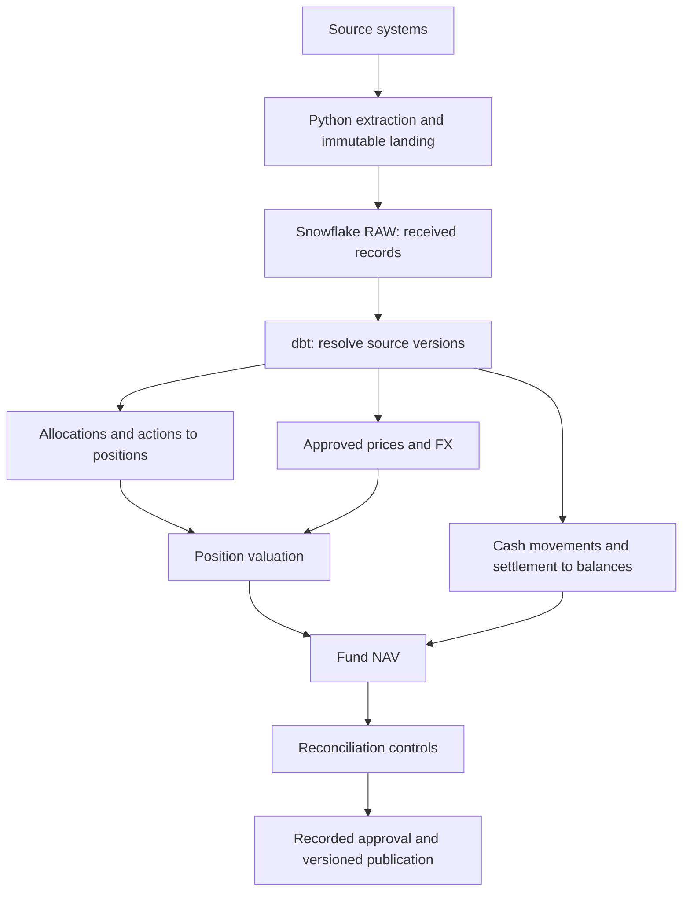

# Direction of travel

This is a proposed architecture. Local CSV valuation, saved input deliveries,
manifest checks and replay from a selected delivery are implemented. A separate
quantity-only lesson derives positions from executions and allocations, with
exact-repeat handling and allocation-total checks. Part 4 reuses those checks
to calculate settled GBP cash and outstanding obligations from execution terms
and full-settlement confirmations. Part 5 combines those balances and positions
with dated synthetic GBP closing prices to calculate NAV. Part 6 reconciles
positions, settled cash and NAV with separately hand-worked synthetic references,
checks missing records in both directions, and saves comparison reports with
input lineage. Part 7 stores frozen candidates, asserted local reviewer records
and versioned publications in SQLite transactions. Real counterparties,
authenticated reviewers and cloud publication remain pending. Part 8 connects
the EODHD demo API for a fixed historical Apple/Amazon sample, preserving raw
responses and converting prices to our CSV contract. A separate USD scenario
uses simulated trades through the same financial controls. Part 9 uses dated
ECB reference observations to translate the USD close into a separate GBP
reporting snapshot. Part 10 adds synthetic GBP reference reconciliation and local
publication with FX evidence; mixed-currency operational accounting is not implemented.

The first release should give fund operations a daily close they can reconcile
and approve. Portfolio managers and risk analysts should see the holdings and
exposures behind that same approved version. Reporting should use approved
fund aggregates. Freshness targets and operating cut-offs are still to be agreed.

**Immutable landing** means preserving deliveries unchanged so a result can be
reproduced. Start with a local directory; S3 is the cloud target. **RAW** means
data kept close to its received form. **dbt** will own analytical SQL models;
**Snowflake Tasks** will coordinate in-warehouse jobs, dependencies, retries and
historical reruns. External producers will upload source files to Snowflake
internal named stages. Snowpipe will load those files before the daily task graph
runs.
**Terraform** will define infrastructure, separate from dbt's analytical tables.

## Proposed sources

These are logical sources, not seven services we need to deploy today. Full
contracts, retry rules, revision handling and cut-offs are still pending.

| Source | Proposed transport and cadence | Local fallback |
| --- | --- | --- |
| Market prices/actions | Provider API, daily close | Fictional prices; actions later |
| Security identifiers | Reference API, daily change check | Small curated security list |
| FX rates | Reference API, daily valuation rates | Hand-worked GBP/USD fixtures |
| Order management system (OMS) | PostgreSQL versioned events, daily batch | Connected synthetic trades |
| Investor administration | Dated daily file | Synthetic fund-unit/flow records |
| Prime broker | Dated daily position/cash files | Independently worked balances |
| Fund administrator | Dated daily NAV file | Independently worked NAV |

EODHD's public demo API is connected for private historical-price learning only.
Production market-data selection and redistribution rights remain unresolved.
ECB is also connected for historical reference FX. Other sources are synthetic
or planned. Public repository fixtures remain
independently generated synthetic inputs; downloaded data and derived examples
stay in ignored local storage. See the Part 8 source/usage review.

## Proposed row meanings (grains)

A **grain** says exactly what one row represents. Getting this wrong can make
a join multiply rows and inflate financial totals.

| Model | One row per |
| --- | --- |
| Execution history | Source + execution ID + source version |
| Allocation history | Source + allocation ID + source version |
| Approved price | Instrument + valuation cut-off |
| FX | Currency pair + valuation cut-off |
| Daily position/valuation | Portfolio + instrument + business date + run |
| Cash balance | Fund + account + currency + business date + run |
| Fund NAV | Fund + business date + publication version |
| Control result | Run + control + date + entity being compared |

The first fixture simplifies cash to one fund balance. Delivery manifests now
preserve input identities and receipt times; calculation outputs and run history
are not persisted. Identifier mapping and source timestamps come later.

## What makes the eventual daily job credible

- A rerun of the same delivery has no duplicate financial effects.
- Missing required data prevents publication and produces a useful diagnostic.
- Broker/admin comparisons detect deliberately introduced discrepancies.
- Every result traces to its input deliveries and rules.
- Corrections produce auditable new versions of affected dates.
- An approved result is exposed only after controls and recorded approval.

Kafka, intraday risk, a dashboard and an API are deferred until the batch close
works. Cloud SQL and deployment behaviour remain UNVERIFIED until actually run
in an authorised account. A daily scheduler alone does not make this production-ready.

## GBP review and publication

Part 10 connects GBP translation to local publication. Candidates preserve the
USD close, GBP close and FX evidence. Separate synthetic GBP NAV/cash reference
arithmetic and raw-leg direction checks join all USD controls before approval.
New FX versions require matching references and new reviews. See
`docs/lesson_10_gbp_approval.md`; authenticated review and deployment remain pending.

## Saved-input pipeline runner

Part 11 provides `fund_pipeline/run_pipeline.py` for one-command historical replay of explicitly
selected saved deliveries. It checks inputs, prepares the reconciled candidate,
checks eligibility and records READY_FOR_REVIEW or FAILED with an error stage.
It does not approve or publish. Each attempt gets a separate run record and each
new calculation a separate candidate. Part 12 reuses eligible candidates for the
same dates, currency, manifest fingerprints and financial code within one database.
Lookup, creation and reuse registration share a SQLite transaction. Each run still
gets its own record. Scheduling and interrupted-log resolution remain pending.

## Run configuration

Part 13 adds an explicit JSON run configuration with dates, four saved input
locations and output locations. Paths resolve relative to that file. The runner
records its settings and fingerprint. It selects existing deliveries; automatic
ingestion and discovery remain pending.

## Machine learning scope

The user's updated scope includes ML after the reliable daily batch path.
Plan one row per portfolio per business date containing features such as trade
count, turnover and concentration. Compare a simple rule baseline with Isolation
Forest, trained on earlier dates and evaluated on later dates. Store scores and
model versions for review; ML flags must not replace financial controls or block
the accounting close merely because activity is unusual. No model is built yet.
Evaluation on simulated activity demonstrates the method, not real-world accuracy.
